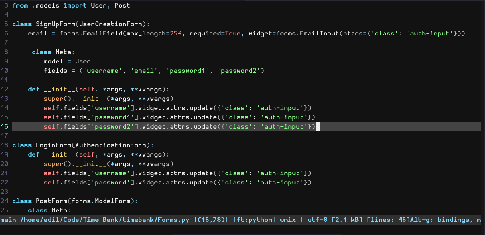
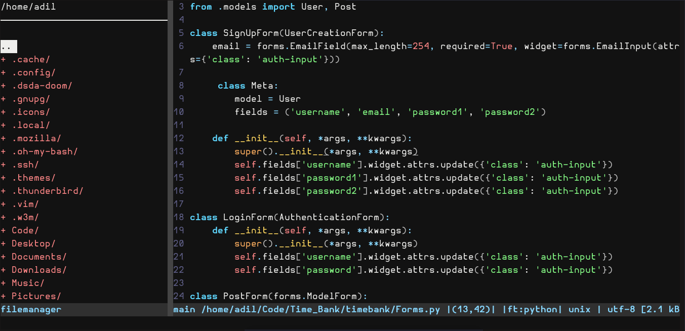

# Chill Dark Theme 

A Chill dark theme for the Micro text editor. Use this if you are just a chill dude looking for a chill theme with eye-cooling syntax highlighting.

## Screenshots







## Set up

1. Create a /colorschemes directory in your ~/.config/micro/ directory and navigate to the directory.
```cd .config/micro/ && mkdir colorschemes```

2. Create a file with the name of the theme ending with .micro, for example ** dark.micro**.

3. copy paste the code given in the file dark.micro to your .micro file and save it.

4. and voila! you have added a theme to your colorschemes. Now you can go ahead and open micro. hit Ctrl-e and type ```set colorscheme dark ```, you must write the same name of the file you created in the colorschemes directory. 


